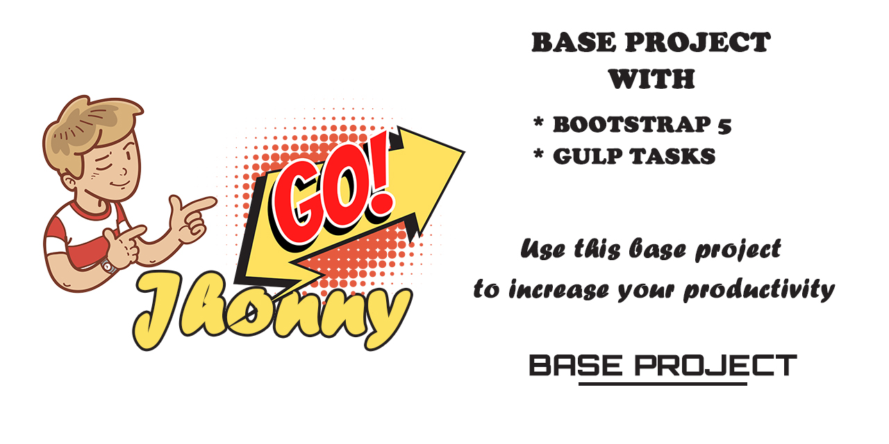

# Base project with Bootstrap 5
Base structure for project with B5

<p align="center">
  
</p>

&nbsp;
## Requirements
* Must have installed Composer & Node in your PC.

	You can download node by clicking in the follow address [https://nodejs.org/es/download/](https://nodejs.org/es/download/)

    You can download and install composer following the instruction in the official web page [https://getcomposer.org/download/](https://getcomposer.org/download/)

&nbsp;
## Description

This structure will help you start any project with a base structure and a series of automated tasks through the use of GULP.

&nbsp;
## Features

With this structure you can:

* Obtain a base structure to increase your productivity.

&nbsp;
## Tools, software and packages used
* Bootstrap 5
* Gulp
* Sass
* Node
* Composer

&nbsp;
# How to use it
## Step-by-step installation.
    
1. Get the project.

    ##### USE THE OPTION YOU WANT TO GET THE PROJECT
    
    ---
    
    ###### OPTION 1 - GET FROM COMPOSER
    
    > Go to where you want to create the project.
    
    ```sh
    #> cd C:\Users\User\Documents
    ```

    > Create folder for your project.
    
    ```sh
    #> mkdir my-project
    ```

    > Go to the new folder.
    
    ```sh
    #> cd my-project
    ```
    
    > Create project using composer.
    
    ```sh
    #> composer create-project jhoncytech/proyecto-base-b5 .
    ```

    > In your node terminal, if you dont have GULP execute.
    
    ```sh
    #> npm i -g gulp gulp-cli
    ```
    
    > In your node terminal, execute the follow command.
    
    ```sh
    #> npm i
    ```
    
   ---

# Available project's commands

## Local development environment
*   Start gulp tasks: `#> gulp`

# 

<p align="center">
  
</p>

### Contactos
    - Mail: jhonny@jhoncytech.com
    - Web: https://jhoncytech.com
    ---
    - Mail: contacto@jhonnygo.com
    - Web: https://jhonnygo.com
